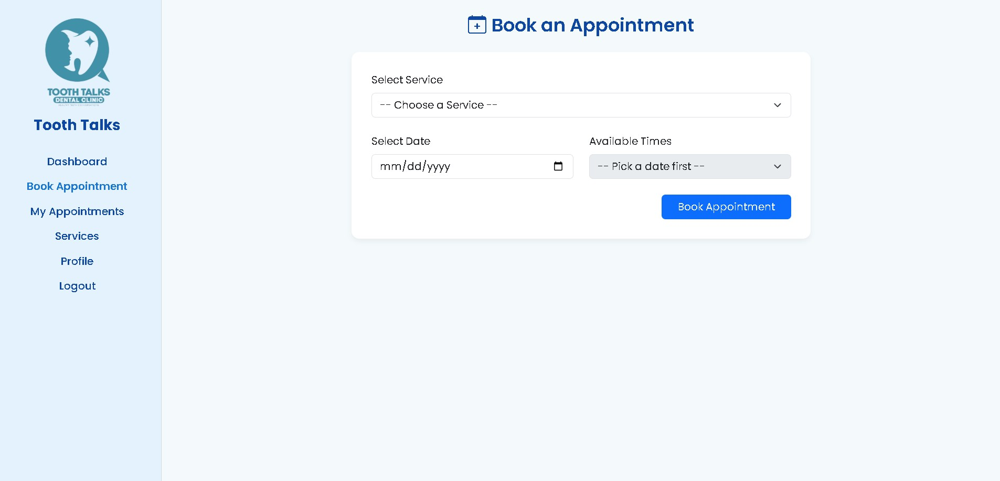

Dental Clinic Management System
A web-based dental clinic system built with PHP and MySQL.  
Patients can register, log in, and manage appointments, while administrators can manage patient records and clinic data through a secure dashboard.

Features
- User authentication with secure password hashing
- Role-based access (Admin & Patient)
- Patient registration and appointment management
- Admin dashboard for managing patients and clinic data
- CRUD operations for appointments and patient records
- Session management for logged-in users

Tech Stack
Backend: PHP  
Database: MySQL  
Frontend: HTML, CSS, JavaScript  
Server: XAMPP (Apache + MySQL)

Setup Instructions (Localhost)
1. Clone the repository:
git clone https://github.com/yourusername/dental-clinic-system.git
2. Move the folder to your XAMPP htdocs directory:
C:\xampp\htdocs\dental-clinic-system
3.Open phpMyAdmin and create a new database (e.g., dental_clinic).
4. Import database.sql into the database.
5. Open your browser and visit:

Demo Account
Username: admin
Password: admin
